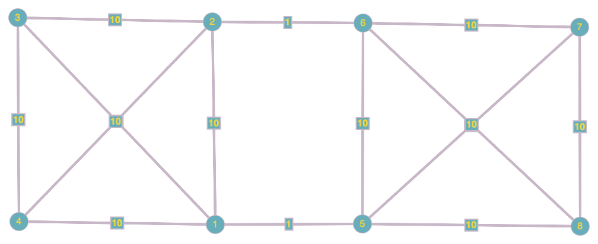
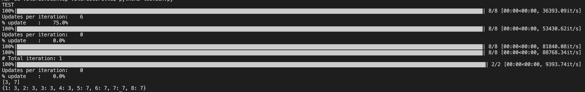
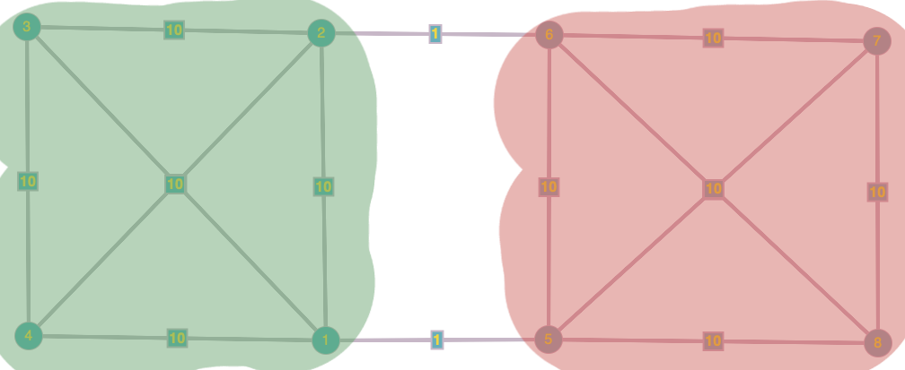

<h1 align="center">Community detection</h1>
<h2>Modularity</h2>
<p><strong><em>Communities</em></strong>: sets of tightly connected nodes
<strong>Define</strong>: <em>Modularity</em> <em>Q</em></p>
<ul>
<li>A measure of how well a network is partitioned into communities</li>
<li>Given a partitioning of the network into groups :</li>
</ul>
<p align="center" style="text-align: center;"></p>
<p>Given <em>G</em> on <strong><em>n</em></strong> nodes and <strong><em>m</em></strong> edges, the <strong>expected number of edges</strong> between nodes <em>i</em> and <em>j</em> of degrees  and  is equals to:</p>
<p align="center" style="text-align: center;"></p>
<p><strong>Modularity of partitioning S of graph G</strong>:</p>
<p align="center" style="text-align: center;"></p>
<p>where:  if , 0 else</p>
<p>Modularity values take range . It is positive if the number of edges within groups exceeds the expected number.</p>
<p><strong>KEY IDEA</strong>: We can identify communities by <strong>maximizing modularity</strong></p>
<h2>Louvain algorithm</h2>
<p>Greedy algorithm for community detection. Complexity at run time: .</p>
<p>Louvain algorithm <strong>greedily maximizes modularity</strong>. Each pass is made of 2 phases:</p>
<ul>
<li><strong>Phase 1</strong>: Modularity is optimized by allowing only local changes to node-communities memberships</li>
<li><strong>Phase 2</strong>: The identified communities are aggregated into super-nodes to build a new network</li>
<li><strong>Goto Phase 1</strong></li>
</ul>
<p>The passes are repeated iteratively <em>until no increase of modularity is possible</em>.</p>
<h4>Phase 1</h4>
<p>Put each node in a graph into a distinct community (one node per community). For each node <em>i</em>, the algorithm performs two calculations:</p>
<ul>
<li>Compute the modularity delta  when putting node 𝑖 into the community of some neighbor <em>j</em></li>
<li>Move <em>i</em> to the community of node <em>j</em> that yields the largest gain in </li>
</ul>
<p>This first phase stops when a local maximum of the modularity is attained, i.e., when no individual node move can improve the modularity.
What is  if we move node <em>i</em> to community <em>C</em>?</p>
<p align="center" style="text-align: center;"></p>
<p>where:</p>
<ul>
<li> = sum of link weights between nodes in <em>C</em></li>
<li> = sum of all link weights of nodes in <em>C</em></li>
<li> = sum of link weights between node <em>i</em> and <em>C</em></li>
<li> = sum of all link weights (i.e., degree) of node <em>i</em></li>
<li><strong><em>gain</em></strong>: modularity contribution after merging node <em>i</em></li>
<li><strong><em>loss</em></strong>: modularity contribution before merging node <em>i</em></li>
</ul>
<h4>Phase 2</h4>
<p>The communities obtained in the first phase are contracted into <strong>super-nodes</strong>, and the network is created accordingly:</p>
<ul>
<li>Super-nodes are connected if there is at least one edge between the nodes of the corresponding communities</li>
<li>The weight of the edge between the two super-nodes is the sum of the weights from all edges between their corresponding communities</li>
<li>Phase 1 is then run on the super-node network</li>
</ul>
<h2>Summary</h2>
<p><strong>Modularity</strong>:</p>
<ul>
<li>Overall quality of the partitioning of a graph into communities</li>
<li>Used to determine the number of communities</li>
</ul>
<p><strong>Louvain modularity maximization</strong>:</p>
<ul>
<li>Greedy strategy</li>
<li>Great performance, scales to large networks</li>
</ul>

## Pseudocode

* **Description**: Given a graph G, finds the optimal community for each node

* **Parameters**:
    ```
    G : Graph
        Must be an undirected weighted graph.
    ```
* **Returns**:
    ```
    communities : Dictionary 
        Map each node to a community.
    ```


#### INIT

Put each node in a graph into a distinct community (one node per community).
```javascript
communities = {}
for each (v in G):
    communities[v] = v
```

where *communities[v]* is the community of node *v*.


#### PHASE 1

```javascript
P1(G, communities):

    converged = False

    while(!converged):
        converged = True

        // Set modularity of each node
        for each (v in G):
            max_modularity = -1                         // Modularity is in [-1, 1]
            max_community = None

            for each (edge in v):
                w = edge[0]                             // w is a node such that there exist v → w

                tmp = communities[v]
                communities[v] = communities[w]
                modularity = // See formula (2) above
                if (modularity > max_modularity):
                    max_modularity = modularity
                    max_community = communities[w]

                communities[v] = tmp

            if (max_modularity > 0):
                communities[v] = max_community
                converged = False                       // louvain converges only when the modularity is not updated

                update sum_in
                update sum_tot
                update k_in

    return communities
```


#### PHASE 2

```javascript
P2(G, communities):

    G_new = {}

    for each (c in communities):
        G_new[c] = new set()

    for each (v in G):
        cv = communities[v]
        for each (edge in v):
            w = edge[0]
            cw = communities[w]
            
            if cv != cw:
                G_new[cv][cw] += 1
        delete G[v]

    return G_new, communities
```

#### Example
* **Input Graph**:
<center></center>

* **Output**:
        Communities = {1: 3, 2: 3, 3: 3, 4: 3, 5: 7, 6: 7, 7: 7, 8: 7}
<center></center>
<center></center>

---
#### Reference 
> CS246: Mining Massive Datasets Jure Leskovec, Stanford University - **Community Detection in Graphs**: http://cs246.stanford.edu

> Vincent D. Blondel, Jean-Loup Guillaume, Renaud Lambiotte, Etienne Lefebvre - **Fast Unfolding of communities in large networks**: https://arxiv.org/abs/0803.0476